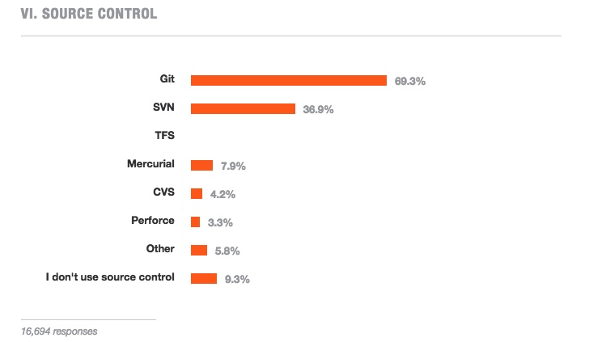

The results of the [Stack Overflow survey](http://stackoverflow.com/research/developer-survey-2015) have been released. Most of the results are unsurprising in most respects, the most popular development language is Javascript, most users are on Windows and there is a deficiency of women in tech. The one statistic that stood out for me is the fact that almost 10% of developers still do not source control their work.

Screenshot of the source control results from the Stack Overflow survery

15.9% of people who took the survey identified themselves as a student, while 66.3% identified themselves as been in full-time employment. I know from been a student who has taken a year out to work in industry, that most Computer Science/Software Engineering students do not bother with, nor fully understand why and how to use source control. That is understandable as the vast majority only write the code they need for the class and don't spend hours programming just to learn and get better. The worrying part is, if we say there was a 4:1 ratio of professionals to students, we can then determine that roughly 7.5% of professionals do not use source control
